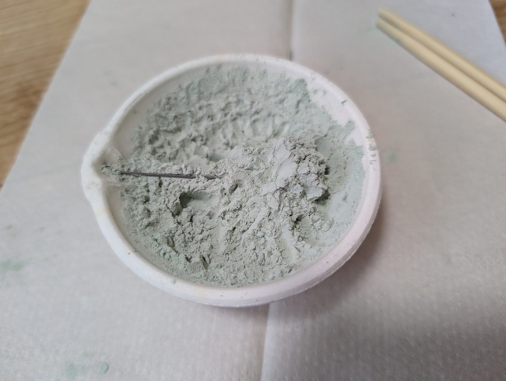
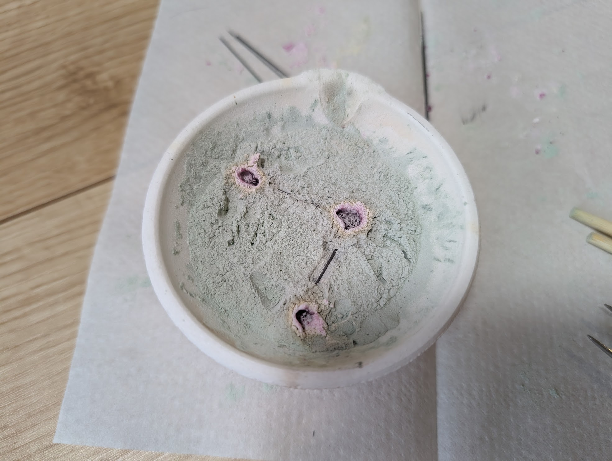
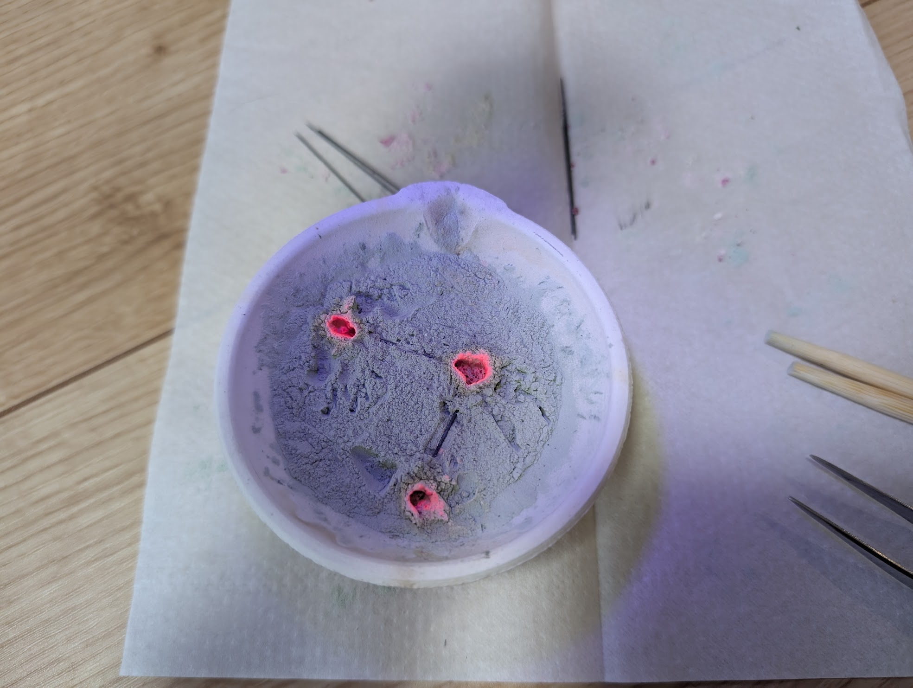
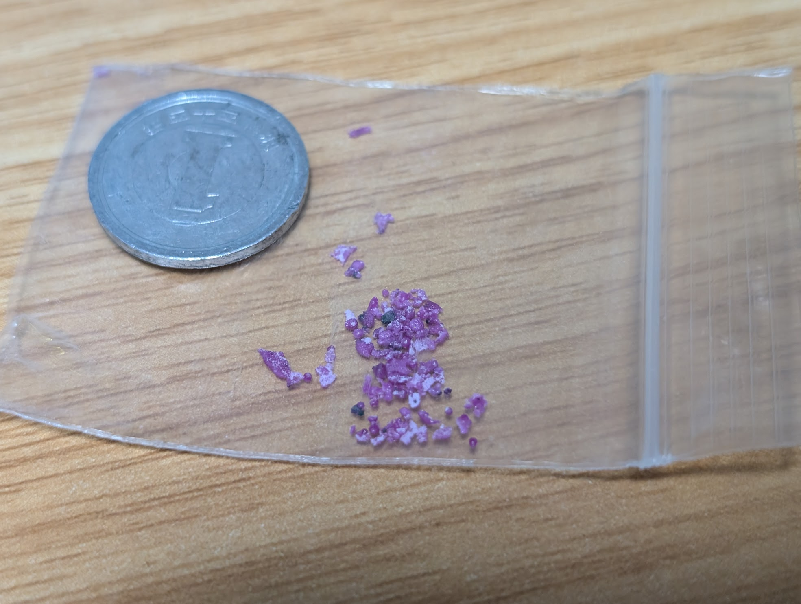
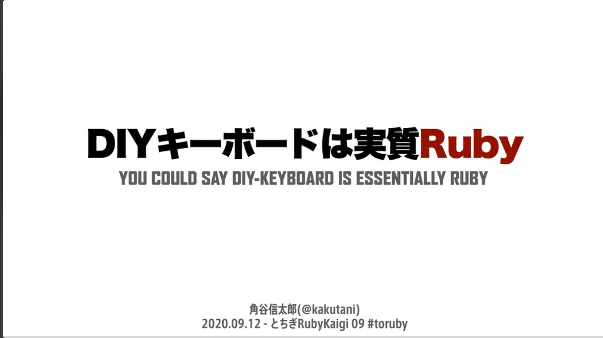
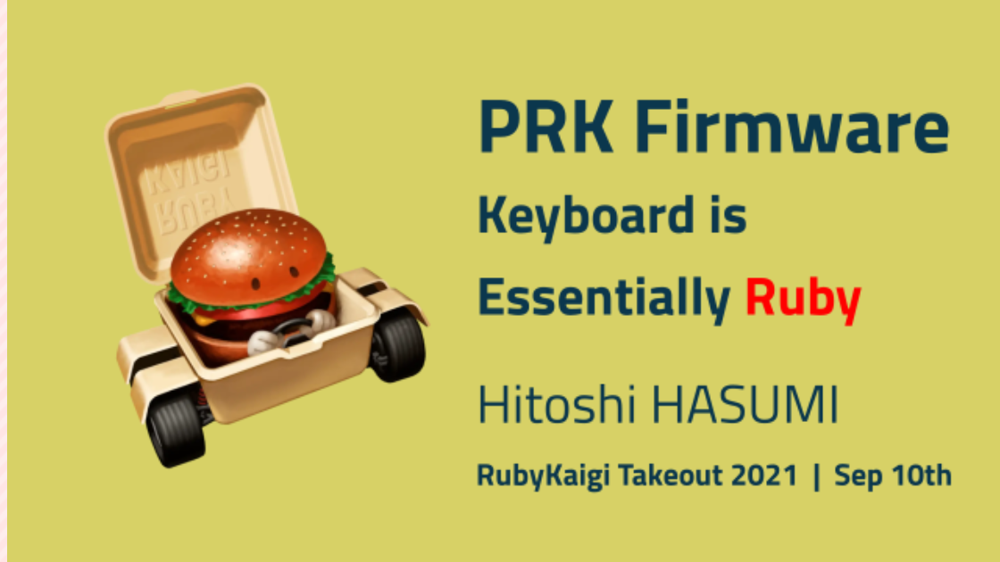
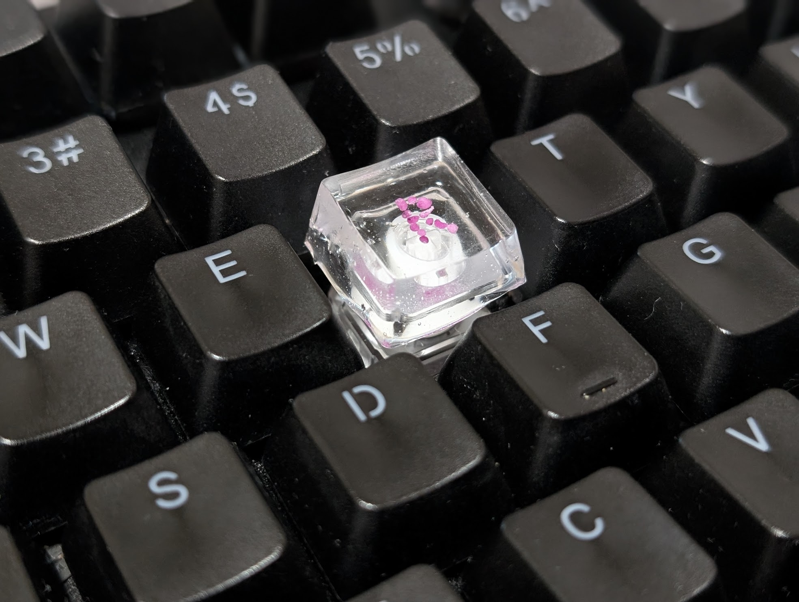

# 自分だけのRubyを1から作る

松江Ruby会議12
2026-06-06

---

## pp self

- pocke
- 岡山県在住
- Rubyコミッタ
  - RBSのメンテナ

今日はRubyのコミッタらしく、Rubyを作る話をします

先週までは藤原桒原備中守歩通鍵仁雄と名乗っていました

---

## Rubyを作る

---

## Rubyを作る

Rubyを作るには、まずRubyがどのように構成されているかを必要がある

---

## Rubyの構成要素

- Rubyは以下の要素で構成されている
    * Lexer: ソースコードをトークン単位に分割
    * Parser: 木構造に変換
    * Compiler: 実行命令に変換
    * Virtual Machine: 命令を実行
* ...という話は今回はしません。

この会場にはCRuby, mruby, Spinel, PicoRubyの作者がいるらしい

---

## Rubyの構成要素

- Rubyは以下の要素で構成されている
    * 酸化アルミニウム
    * 微量のクロム
* つまり、鉱石のRubyの話をします
  - またこの人ミスリードな話をしてる……

----

## 人工的なRuby

---

## 人工的なRuby

Rubyは人工的に合成できることが知られています。

- ベルヌーイ法(火炎溶融法)
  - 原料粉末を炎で溶かして結晶化させる
- フラックス法
  - フラックス(融剤)に原料を溶かし、冷やし固める
- などなど
- レーザーや研磨剤で使われているのが有名

材料を高温で溶かして固めるのが基本戦略

ベルヌーイ法は1902年に開発された、初めて商業的に成功した人口宝石の製造法

---

## 人工的なRuby

しかし工業的な方法は一般のご家庭では難しい

- 高温の用意がむずかしい
- 装置の用意がむずかしい
- フラックスの用意がむずかしい

ではどうやって高温を用意するか

---

## 一般のご家庭でも作れるRuby

電子レンジを使う

- シャープペンシルの芯をレンチンする
- 高温のプラズマが発生する
- プラズマで材料を溶かし、Rubyにする

レンチン solves everything

---

## Rubyの作り方

---

## Rubyの作り方

用意するもの(全部Amazonで買えます)

- [酸化アルミニウム粉末](https://www.amazon.co.jp/dp/B0B3LPQSL8) (アルミナ)
  - 釉薬などに使われているらしい
- [酸化クロム粉末](https://www.amazon.co.jp/dp/B0G6YZJM32)
  - 陶芸用途で使われるらしい
- [るつぼ](https://www.amazon.co.jp/dp/B09FSLK3DD0)
  - おちょこでも良いらしい

- シャープペンシルの芯
  - 太さ、濃さはあまり重要ではない
- どうなってもいい電子レンジ
  - ちょうど家に電子レンジが余っていたのでそれを使いました
- UVライト
  - Rubyは紫外線を当てると光る性質があるので、これでRubyを探します

アルミナと酸化クロム、めっちゃ余っているので追試したい人がいたら差し上げます

---

## Rubyの作り方

1. るつぼに酸化アルミニウム、酸化クロムを入れ、混ぜる。
    - 酸化クロムは酸化アルミニウムの重量比1% ~ 5%程度
    - 今回は2%ほどの酸化クロムを使用
2. るつぼの上にシャープペンシルの芯を置く
3. 1分ほどレンジでチンする
4. Rubyが生成される!
5. UVライトを当てながら、出来たRubyを探す

---

## 注意すること

- Rubyを作るのに使った電子レンジは、食品用に使わないようにしましょう
  - 壊れてもいい電子レンジを使いましょう
- 酸化クロムには毒性があります
  - 吸わない
  - 身体についたら洗う
  - マスク、眼鏡、手袋などをつけましょう
- 酸化アルミニウムも吸い込むと危険です

安全に注意して作りましょう

---

## Rubyを作ってみた

---

## Rubyを作ってみた

材料を混ぜて、シャープペンシルの芯を置く

割り箸やピンセットがあると便利

---

## Rubyを作ってみた

<video src="./images/microwave.mp4" controls width="640" />

レンチンする

結構派手に光ります

---

## Rubyを作ってみた

UVライトを当てながらより分ける

UVライトはかなり便利

---

## Rubyを作ってみた

完成!
米粒よりも小さいサイズですね……。

こんな小さい粒だけど、初めて自分でRubyを作ったときはかなり感動しました。

---

## Rubyを作るコツ

- プラズマの持続時間を長くするのが重要
  - Rubyが多く・大きくできる
- シャープペンシルの芯は、半分に折ってくの字型に置くと良い
- シャープペンシルの芯は材料に埋めすぎると反応しない
- 1分間レンチンした後、材料が溶けたところに材料を集め直して再度レンチンすると大きくなる?
  - 試行回数が少ないが、この方法で一番大きい物ができた
  - レンチン直後はかなり熱いので注意が必要

結構試行錯誤していました

---

## Rubyの活用事例

----

## Rubyの活用事例

単に作って楽しいだけでなく、ちゃんと活用したい!
もちろんプログラミングに役立つ形で……!!

---

## キーボードは実質Ruby

by @kakutani
[とちぎRuby会議09](https://speakerdeck.com/kakutani/diykeyboard-is-ruby) 
2020-09-12

by @hasumikin
[RubyKaigi Takeout 2021](https://slide.rabbit-shocker.org/authors/hasumikin/RubyKaigiTakeout2021/)
2021-09-10

by @hasumikin
[RubyKaigi 2026](https://slide.rabbit-shocker.org/authors/hasumikin/RubyKaigi2026/)
2026-04-22

角谷さんによる言葉だと言うことを、この発表の準備をしてて知りました

----

## キーボードは実質Ruby

<video class="bg-video" src="./images/ruby-on-keyboard.mp4" autoplay loop muted playsinline></video>

---

## キーボードは実質Ruby

- RubyでRのキーキャップを作った
  - [キーキャップ型](https://www.amazon.co.jp/dp/B09FXSLJ6B)にレジンを流し込んで作った
  - Rの形にRubyを並べるのが大変
- 本物の(合成)Rubyでできたキーキャップ!
  - テンションが上がる

もはや実質ではなく、"キーボードはRuby"と言ってもいいのでは

このキーボードでRubyを実装したら、[RubyでつくるRuby](https://www.lambdanote.com/products/ruby-ruby)ができる

---

## 最後に

---

## 参考文献

- [雨の日はルビーを作って・・・](https://limejuice.jugem.jp/?eid=269)
  - 個人ブログ。詳細に書かれていて参考になる
- [電子レンジ内で発生するプラズマの分析](https://storage.nakatani-foundation.jp/main/p/uploads/36f8b9403e4e98267bff64be234ead13.pdf)
  - うまくプラズマを発生させられず試行錯誤していた時に、芯の長さが重要だと気がつくきっかけを得た。

他にも「ルビー 電子レンジ」でググった結果のページを色々参考にしています。

ご家庭や科学教室でRubyを作っているケースが結構あるみたいです

---

## まとめ - 自分だけのRubyを1から作る

- Rubyは電子レンジで作れる
  - 安全には気をつけて
- キーボードはRuby

ご清聴ありがとうございました。
キートップ、Rubyの実物は持ってきているので声をかけてね💎

